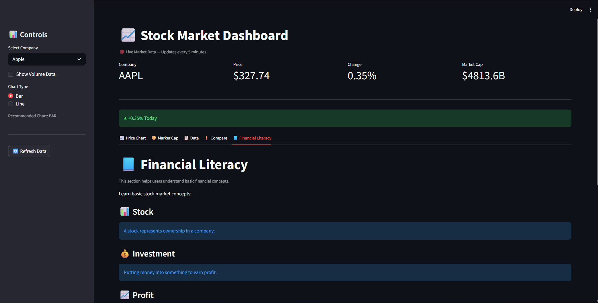

# 📈 Stock Market Dashboard

A real-time stock market dashboard built with Streamlit — tracks live prices for major tech stocks, compares companies side-by-side, and includes a built-in financial literacy section for beginners.

**[🔗 Live Demo](#)** *(add your Streamlit Cloud link here after redeploying)*



---

## ✨ Features

- **Live market data** for Apple, Google, Microsoft, Tesla, and Amazon via the Yahoo Finance API, auto-refreshing every 5 minutes (cached to avoid hammering the API)
- **Interactive metrics** — price, % change, and market cap for the selected company, with a live up/down indicator
- **Price Chart tab** — toggle between bar and line chart views
- **Market Cap tab** — pie chart breakdown across all tracked companies
- **Data tab** — full data table with optional volume chart and CSV export
- **Compare tab** — pick any two companies and compare price, market cap, or % change side-by-side
- **Financial Literacy tab** — plain-language glossary of core investing terms (stock, dividend, risk, etc.) for beginners
- Manual refresh button to force-clear the cache and re-pull live data on demand

## 🛠️ Tech Stack

- **Streamlit** — app framework and UI
- **yfinance** — live stock market data (Yahoo Finance)
- **Pandas** — data handling
- **Plotly Express** — interactive charts (bar, line, pie)

## 📦 Setup & Run Locally

1. Clone the repo:
   ```bash
   git clone https://github.com/harminpatel793/stock-market-dashboard.git
   cd stock-market-dashboard
   ```

2. Install dependencies:
   ```bash
   pip install -r requirements.txt
   ```

3. Run the app:
   ```bash
   streamlit run Dashboard.py
   ```

No API key required — `yfinance` pulls public market data directly.

## 📌 Notes

- Data is cached for 5 minutes (`@st.cache_data(ttl=300)`) to avoid excessive API calls; use the "Refresh Data" button in the sidebar to force an update.
- Market data reflects the most recent trading session available from Yahoo Finance at the time of the request.

---

Built by [Harmin Patel](https://github.com/harminpatel793) · [LinkedIn](https://linkedin.com/in/harmin-patel)
